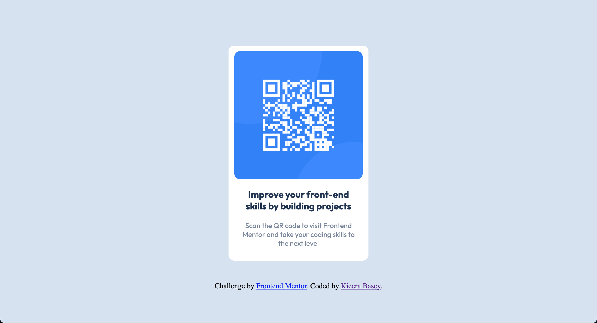

# Frontend Mentor - QR code component solution

This is a solution to the [QR code component challenge on Frontend Mentor](https://www.frontendmentor.io/challenges/qr-code-component-iux_sIO_H). Frontend Mentor challenges help you improve your coding skills by building realistic projects. 

## Table of contents

- [Overview](#overview)
  - [Screenshot](#screenshot)
  - [Links](#links)
- [My process](#my-process)
  - [Built with](#built-with)
  - [What I learned](#what-i-learned)
  - [Continued development](#continued-development)
- [Author](#author)
- [Acknowledgments](#acknowledgments)

## Overview

### Screenshot



### Links

- Solution URL: [GitHub](https://github.com/kbasey/QR-code).
- Live Site URL: [Netlify](https://magenta-semolina-b3b121.netlify.app).

## My process

### Built with

- Semantic HTML5 markup
- CSS custom properties
- Flexbox

### What I learned

During this project I learned how to properly import the Google Font -- Outfit.

```
<link rel="preconnect" href="https://fonts.googleapis.com">
  <link rel="preconnect" href="https://fonts.gstatic.com" crossorigin>
  <link href="https://fonts.googleapis.com/css2?family=Outfit:wght@400;700&display=swap" rel="stylesheet">
  ```

### Continued development

In future projects, I want to work on making the page responsive for multiple viewports.

yourself when you look back on this project in the future.**

## Author

- Website - [Kieera Basey](https://github.com/kbasey)
- Frontend Mentor - [@kbasey](https://www.frontendmentor.io/profile/kbasey)


## Acknowledgments

I want to thank Zero To Mastery and The Odin Project for providing the courses and information for the foundation of my self-taught journey with HTML and CSS.
